# Support Wheel Of Fate

### Client side

Window Preview

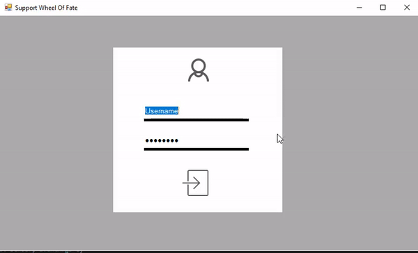

Client overview

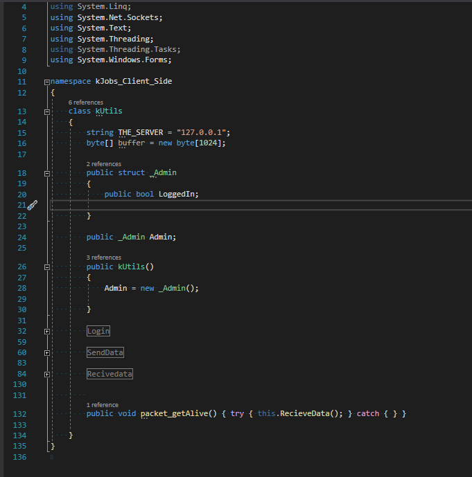

Client - Server information and handling based on socket sent message

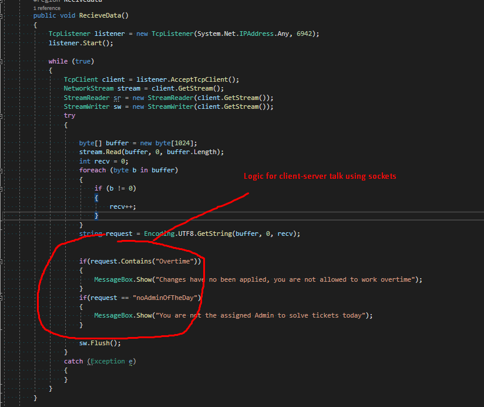

Live communication on a different port and thread

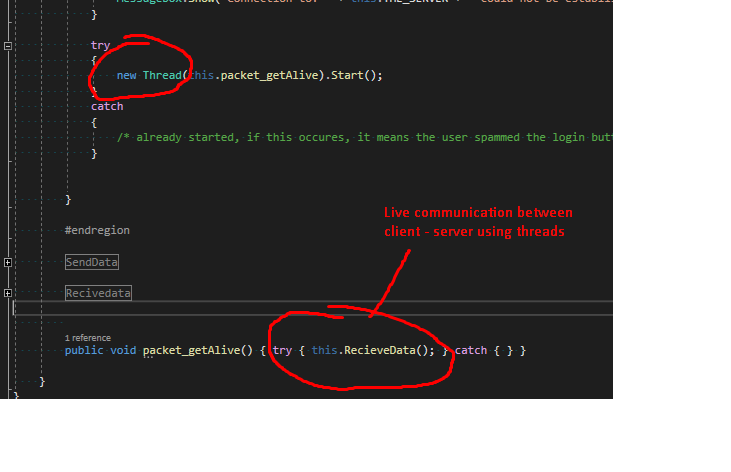

Animations `onHover`

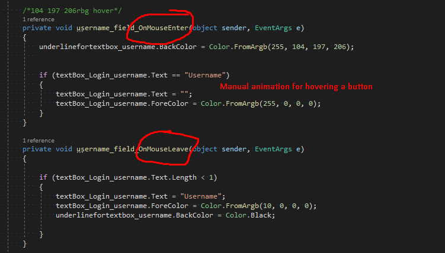

### Server Side

Code Overview

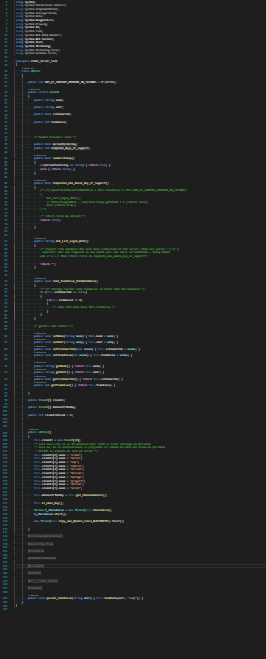

Talk example

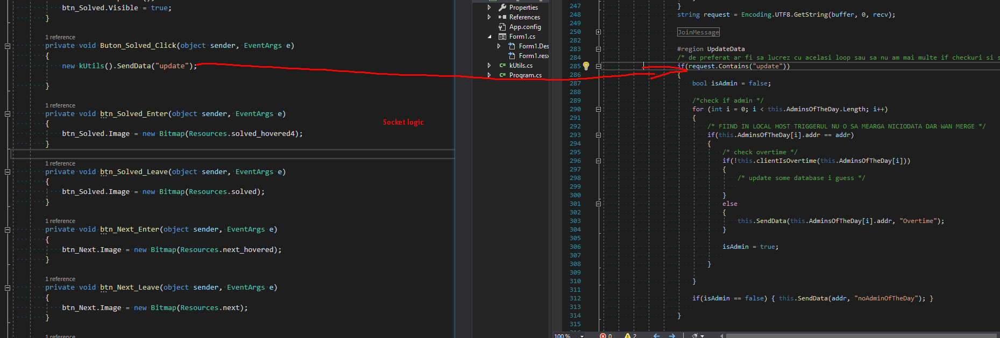

Since admins are in a new vector, handling like so

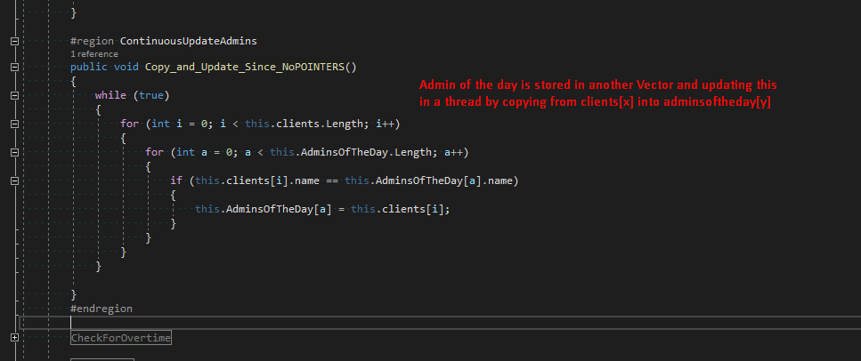

Real time overtime check & syncing info with database

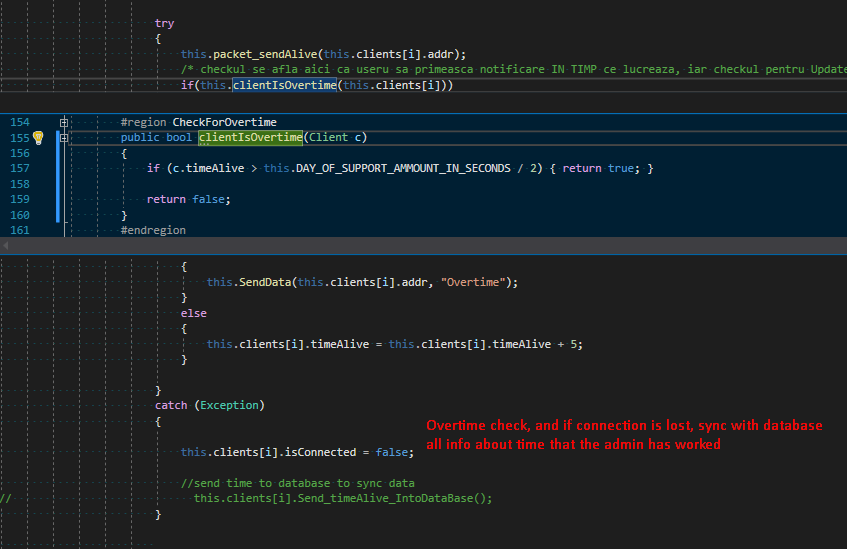

Admins online - live count

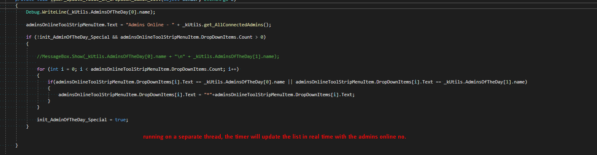

Info on item click

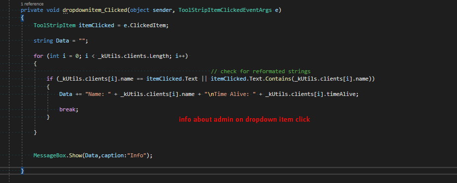

Add admins to the dropdown list

# RAW FORM OF A SERVER CONTROLLER 

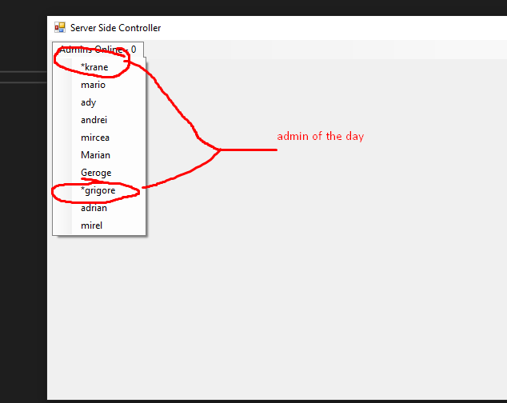

